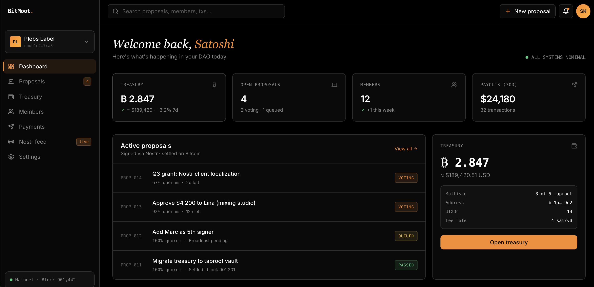

# BitMoot

A DAO platform built entirely on Bitcoin, Nostr, and Lightning.

For:
- Bitcoin/Nostr communities
- Sovereign organization
- Decentralized structures

## Motivation

Many DAOs exists, but real sovereign ones don't.
- Ethereum-dependent: 99% of DAOs require ETH gas, EVM smart contracts, and token bridges. Not self-sovereign.
- No Bitcoin-native option: Bitcoin communities — the ones who care most about sovereignty — have no DAO tooling that matches their values.
- Terrible UX: Seed phrases, gas fees, and wallet popups make onboarding impossible for non-crypto people.

## Sovereign Stack

BitMoot resolves that issue by coupling to sovereign technology for more freedom and ownership:
- Identity: Passkey -> Nostr npub -> Bitcoin wallet
- Governance: Nostr events (multi-relay) · Bitcoin L1 anchoring
- Treasury: Bitcoin Taproot multisig · Miniscript · Timelock backstop
- Execution: Coordinator-optional PSBT · Any member can execute

## Governance design

BitMoot addresses dynamic membership but with a main execution plan.

General members: 
- hold governance token (Spark BTKN tokens)
- vote on proposals via signed Nostr events
- Unlimited, join freely — no on-chain footprint
- Earn governance token for contributions automatically

Council (co-signers):
- Elected by general members, 5-9 seats
- Hold keys in Bitcoin Taproot multisig
- Fixed terms — rotate via one on-chain tx

Governance elects council.

## License

MIT